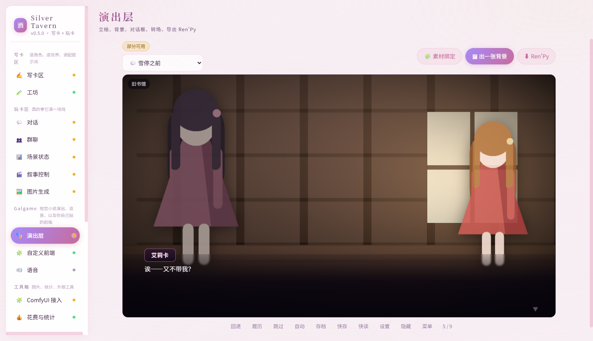
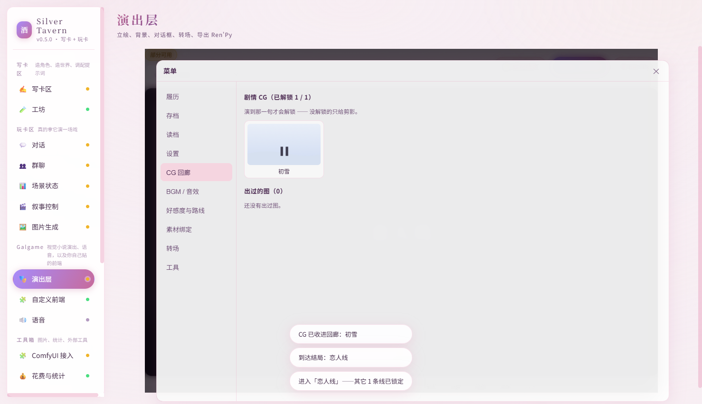
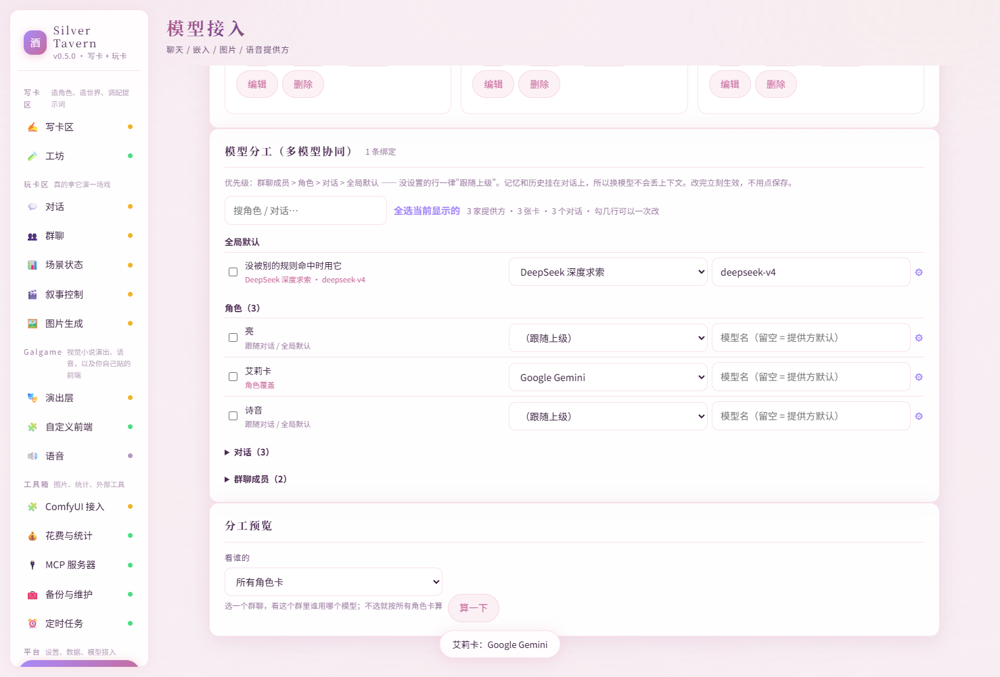
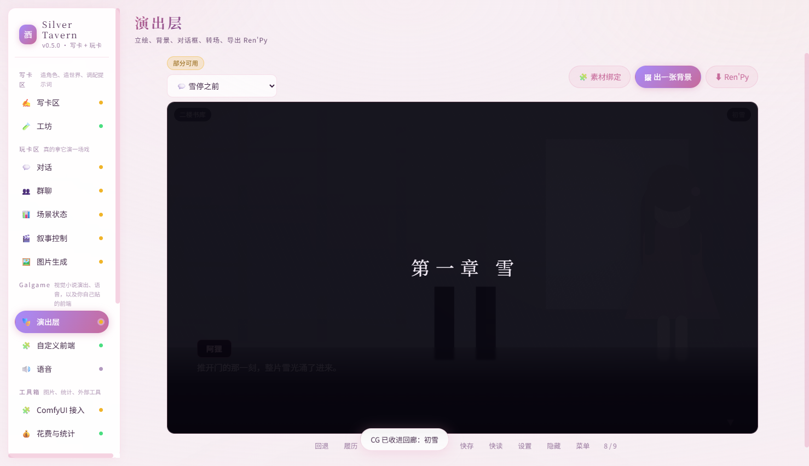

# Silver Tavern

自托管的 AI 角色扮演平台：直接吃 SillyTavern 生态的**角色卡 / 世界书 / 预设 / 对话存档**，
并往**"能演出一部 galgame"**的方向做深。

> **内测中（0.5.1）**：接口和数据结构还会变，升级前请先备份数据目录。
> 这个项目主要给作者自己用，顺手开源 —— 不承诺向后兼容，也不承诺响应时间。
>
> **不接受 issue 和 PR**：这里只发源码，不提供支持。想改、想加功能，直接 fork 一份自己改
> （代码是纯 ESM、零依赖、没有构建步骤，改完刷新就能看到效果）；只想加功能不想动核心代码，
> 可以写插件，见 [`docs/PLUGINS.md`](docs/PLUGINS.md)。



## 它和 SillyTavern 有什么不同

- **演出层**：把一条对话当一部 galgame 演。舞台由写在消息里的指令驱动 ——
  `[场景: 旧书馆]` `[立绘: 阿狸 微笑 左 大]` `[BGM: 雨夜]` `[CG: 初雪]` `[转场: 黑屏 800]`
  `[章节: …]` `[路线: …]` `[结局: …]`；CG **演到才解锁**（没解锁只给剪影）、
  进了一条线别的锁上、还能**一键导出 Ren'Py 工程**。人写、AI 写、群聊多 AI 一起写都认。
- **零依赖 + 单文件**：只用 Node 内置模块（连数据库都是 `node:sqlite`），前端无构建。
  `node scripts/build-exe.mjs` 打出一个约 92 MB 的单文件 exe，拷到哪跑到哪；
  安卓上也能跑（见 `移动端-Termux/`）。
- **私有部署的安全边界**：提供方密钥加密存储；多用户一人一个数据目录，成员不能用
  主机的代理 / MCP / ComfyUI；加密备份 `.stbk` 连主机管理员也解不开。
  边界和取舍都写在 [`docs/SECURITY.md`](docs/SECURITY.md)。
- **接口给 AI 用**：自带 MCP 服务器，Codex / Claude Code 之类的工具可以直接读写这个酒馆。

它**没有**的东西也说清楚：语音合成与识别、Live2D / VRM 动态立绘、第三方扩展生态、
联网搜索 —— 这些要么需要模型接入层再加适配器，要么不在这个项目的方向上。

## 30 秒跑起来

```bash
# 需要 Node 24 或更高；没有 npm install，没有构建步骤
node server/index.mjs
# 浏览器打开 http://127.0.0.1:8788
```

第一次进去先到「模型接入」填你自己的模型（API Key 或本地地址）——
这个软件**不带模型**，也不带任何角色卡或内容。

其它入口：

- Windows 单文件 exe：`node scripts/build-exe.mjs --out build/silver-tavern.exe`
- 安卓（Termux）：见 [`docs/TERMUX.md`](docs/TERMUX.md)
- 几个人一起用：[`docs/MULTI-USER.md`](docs/MULTI-USER.md)

## 截图

| CG 回廊（演到才解锁） | 多模型分工（一行一个对象） |
| --- | --- |
|  |  |



## 功能一览

**当前状态：v0.5.1** 骨架 + 模型接入 + **完整写卡区** + 玩卡区（对话 / 群聊 / 场景状态 /
叙事控制 / **演出层**）+ **工具箱**（ComfyUI 出图 / 花费统计 / MCP 服务器 / 备份与维护 /
定时任务）+ 创作辅助 + 插件机制，并能打成**单文件 exe**。

下面这份清单比较长，是给自己记的账；想先了解怎么用，看上面的「30 秒跑起来」就够了。

- 模型接入：OpenAI 兼容 / Azure / Anthropic / Gemini / 文本补全 / Vertex + 27 个预设；
  多模型协同（按群聊成员 / 角色绑模型，共享同一份记忆与上下文）；写卡助手（8 个技能 +
  多步 Agent）；MCP 客户端（外部工具自动变成技能）。
  输出方式可选**流式 / 整段返回（非流式）**：中转站或本地服务的流式会断、
  或者模型只支持一次返回时切到整段返回，事件流与界面表现都不变。
  模型的**思维链**（提供方给的 reasoning 字段，或正文里的 `<think>` / `<think_nya~>`
  这类标签）会单独收下来，气泡里默认折叠、点开能看、点「编辑」也能看，
  且**不进上下文**（下一轮模型看不到自己的思考）。
- 渠道兼容：公益站与各类中转站（自定义请求头 + 七种鉴权写法）、Google Vertex AI
  （express API key 或服务账号，Gemini 与 Claude 都行）、CLI / 反重力那类本地代理
  （配一条启动命令，调用前自动拉起）。
- 写卡区（本次补全）：
  - 角色卡：PNG（`chara` + `ccv3`）与裸 JSON 卡、V1/V2/V3，**未知字段无损往返**；
    拖拽 / 选文件夹批量导入、导出 PNG / JSON、搜索 / 收藏 / 自定义标签、版本历史与回滚。
    卡内加分项：剧本大纲（梗概 + 分章）、卡内 BGM / 音效清单、角色关系图（可视化）、
    一致性锁定（几个关键设定钉死，改稿时界面 / 写卡助手 / MCP 都拒绝修改）。
  - 世界书：条目增删改、关键词触发 / 正则触发、四种次关键词逻辑、扫描深度、常量、
    概率 / 粘性 / 冷却 / 延迟、分组权重、忽略预算、整体预算裁剪、试触发面板（看命中谁、为什么）；
    酒馆导出形状 ⇄ 卡内 `character_book` 形状互转不丢字段；**语义触发接向量**（有嵌入用余弦，
    没配嵌入就退化成零依赖词重叠）。
  - 提示词：15 段阶段管线、完整宏引擎（内置宏 + 自定义宏 + `{{if}}` 条件块）、
    正则脚本（发送前 / 收到后 / 只改显示、按深度生效）、酒馆预设导入导出
    （**预设的 `prompt_order` 顺序与 8 种位置标记真的生效**：角色描述 / 性格 / 场景 / 我的人设 /
    世界书前后 / 对话示例 / 对话历史落在预设指定的位置，排在历史之后的条目与"绝对位置"注入
    按酒馆的规矩接进对话；**预设顶层的采样参数也能带过来**，分"常用几个 / 全部 / 不用"三档，
    按提供方的适配器过滤后再合并，优先级是 预设 < 提供方默认 < 模型绑定 < 对话设置 < 单次请求）、
  - 预设顶层字段也尽量照做（以前只搬采样参数）：`stream_openai`（流式/整段）、
    `reasoning_effort`、`verbosity`、`openai_max_tokens`、`openai_max_context`、
    `continue_nudge_prompt` / `impersonation_prompt` / `group_nudge_prompt`、
    `assistant_prefill`、`continue_prefill` / `continue_postfix`、`send_if_empty`、
    `use_sysprompt`、`squash_system_messages`、`wi_format` / `scenario_format` / `personality_format`；
    没有对应机制的（模型侧工具调用、联网搜索、内联图片等）会明说，不装作支持。
    前置词 / 后置词、作者注三种位置、三种裁剪策略；**输出后处理完整正则链**
    （全局 → 角色卡 → 预设，AI 输出先过一遍再解析状态块 / 存历史，"只改显示"的进 `displayContent`）。
  - 提示词 X 光机：每轮快照，逐段看 token 与来源，支持"手动踢掉一段再重算"。
  - 对话页控制：**回复上限**（被截断时消息上直接标出来）、**最少字数**
    （作为对话最末尾的一条硬要求发给模型 —— 预设里埋在中间的字数要求模型经常忽略）、
    **思维链**默认折叠、可一键译成中文（或每轮自动译），并且不进上下文。
  - 向量：四类内容（世界书 / 参考资料 / 历史对话 / 记忆）的切块与增量索引、
    关键词 + 向量混合检索、按来源清理、嵌入模型测试。
  - 记忆：小总结（挂消息区间）/ 大总结 / 结构化档案，注入选择与理由可见。
- 素材库：网格预览、按类型筛选、上传 / 删除；**引用计数**能看到一张图被多少条消息、
  出图记录、角色头像引用过。记忆时间线点一条会跳到「对话」里对应的那条消息。
- 工具箱（本次补全，蓝图 3）：
  - ComfyUI：填地址即连（连不上给出人话原因）、导入 ComfyUI 导出的 API 格式工作流并
    自动标出可填参数、`{{char}}` / `{{scene}}` / `{{emotion}}` 这类占位符发请求前替换、
    三种触发（手动 / 回复里写 `[IMG: ...]` / 场景变化自动）、出的图自动进素材库并绑到
    那条消息上、**在对话里就能看到缩略图并点开大图**（出图中显示进度、失败给可读原因并
    可重试）、WebSocket 进度 + 轮询收尾、按用途分的工作流（立绘 / 表情差分 / 背景 /
    CG / 局部重绘）、**内置七种最简示例工作流一键添加**、固定种子与参数可调可预览、
    工作流绑定可加可删。
  - 花费与统计：每轮用量落库（消息删了统计还在），按对话 / 角色 / 天 / 模型 / 提供方汇总，
    可填各家单价（覆盖提供方自带的 `priceIn` / `priceOut`），"预估 vs 实际"对比，
    提示词缓存节省统计（适配层把各家的缓存命中字段透传成 `cachedTokens`）。
  - MCP 服务器：把酒馆自己暴露出去，Codex / Claude Code 一条命令挂上就能列角色卡、
    查对话、发消息触发回复、改世界书、切预设、看提示词快照；`summary` / `search` /
    `index` 三种返回模式省 token，破坏性操作要 `confirm: true`。
  - 备份与维护：一键全量备份 / 恢复（`VACUUM INTO` 快照 + 素材打成一个 zip）、
    启动 / 恢复前 / 清理前 / 批量导入前 / 批量删除前 / 数据库迁移前自动备份并保留 N 份、
    体检并清理孤立素材与失效向量与重复消息、数据统计。
  - 定时任务：每天 / 每周自动备份、自动清理、给指定对话写小总结或大总结；任务清单与
    "上次跑的时间"落库，重启不会把同一个时间点跑两遍；界面能开关、看上次 / 下次运行时间、
    也能"立刻跑一遍"。
- 使用体验：可自定义快捷键（发送 / 继续 / 重生成 / 切换角色 / 搜索，设置里改）、
  Ctrl/Cmd+K 命令面板（搜所有模块与操作）、中文 / English 界面切换（导航 / 按钮 / 设置项）、
  生成完成的通知（响一下 / 浏览器系统通知，都要开关）、护眼暖色主题。
- 创作辅助：对话里一键「变成章节」（润色 + 分段 + 排版，可复制 / 导出 `.md`）、
  角色卡编辑器里「一条龙」（抽世界书条目 + 排分场剧本，可顺手存成世界书）、
  对话里「抽取素材」（人物 / 地点 / 物品，带触发关键词，存成世界书条目）；
  三个技能同时挂在写卡助手的技能列表里，也能被 Agent 多步模式调用。
- 插件机制：`<数据目录>/plugins/<名字>/` 放 `plugin.json` + `index.mjs` 就能加载，
  可以注册 HTTP 接口、写卡技能、MCP 工具和界面视图；坏插件只记一条警告，不影响启动。
  写法见 `docs/PLUGINS.md`。
- 玩卡区：**从卡库选卡开演**（自动带简介与开场白，卡内嵌的世界书跟着生效；也能继续
  "贴一张卡"）、流式对话与逐条重生成 / 编辑 / 删除 / 插入、继续、扮演、系统与隐藏消息、
  每条 token 与整轮花费、多标签、全文搜索、酒馆 JSONL 双向导入导出；群聊四种说话策略与
  活跃度；场景状态（变量 / 属性 / 好感度 / 任务 / 物品 / 地点 / 时间、AI 每轮结构化改动、
  骰子、快照回滚）；叙事控制（候选行动、分支、导演模式，以及**章节管理、结局收集、
  随机事件**：把长对话切成章并可跳转、把触发的结局收进图鉴、按概率插一条旁白小插曲）。
- 候选回复（swipes）：一条回复可以「再来一版」追加候选，用 ◀ ▶ 来回翻；场景状态里
  可以新增角色变量（按角色卡绑定）。
- 写卡区补强：向量检索支持重排（覆盖率 + 整句命中，零依赖）；记忆带热度与时间线；
  卡内前端沙箱的能力边界定死（iframe 隔离 + 白名单 CSP + 能力白名单桥，越界写法静态拦下）。
  卡内前端还补齐了**全局主题**（改 CSS 变量、命名保存、一键应用）与**卡内代码持久化**
  （HTML / CSS / JS 按 scope 存取），布局支持**单栏 / 双栏 / 自适应**，侧栏可拖宽、可收起。
  **卡自带界面**也能存到卡上（跟着 PNG / JSON 导出走），玩卡区的对话里直接跑：
  自己的卡打开对话就自动跑，导入的卡默认要你点一下（可以「信任这张卡」，信任绑代码指纹，
  代码一改就失效）—— 详见 `docs/SECURITY.md` 的 5.3。
- 演出层：把一条对话当 galgame 演 —— 背景层、立绘层、底部对话框（打字机 + 点击继续）、
  选项分支浮层、看 CG；「按当前场景出一张背景」直接复用 ComfyUI（3.1），
  还能一键导出能跑的 Ren'Py 工程（zip 里带 script.rpy 与素材）。加分项也补齐了：
  转场（黑屏 / 闪白 / 震动 / 镜头平移，可设时长并随场景变化自动放）、BGM / 音效
  （音频进素材库、音量可调、按地点自动切、音效库点一下放一声）、CG 回廊（生成过 /
  触发过的图收进相册）、好感度与路线（阈值解锁不同剧情线、多结局收集）。
- 待补：语音（TTS / STT，需要给模型接入层加 speech / transcription 适配器，这次不允许动；
  2.7 的图片生成已经复用 ComfyUI，不再单独造）、标签超市与以图搜图式的素材管理。
- 多用户 / 权限：多用户模式（一个网址 + 登录 + 每人一个数据目录 + 主机管理 + 加密导出）已落地，
  租户默认 ComfyUI「浏览器直连」；见 `docs/MULTI-USER.md` 与 `docs/SECURITY.md`。

产品功能清单见 `docs/功能蓝图.txt`，架构与"往哪里填功能"见 `docs/ARCHITECTURE.md`。
移植自 SillyTavern 的文件登记在 `NOTICE.md`。

## 运行

```powershell
node server/index.mjs      # 然后打开 http://127.0.0.1:8788
```

环境变量：

| 变量 | 默认 | 说明 |
|---|---|---|
| `TAVERN_PORT` | `8788` | HTTP 端口，`0` 表示随机 |
| `TAVERN_HOST` | `127.0.0.1` | 绑定地址 |
| `TAVERN_DATA_DIR` | exe / 项目根旁边的 `data` | 数据库与素材目录 |

## 工具箱怎么用

### ComfyUI 出图

1. 在 ComfyUI 里搭好工作流，用 `Workflow → Export (API)` 导出 JSON。
2. 打开「工具箱 → ComfyUI 接入」：填地址（本地默认 `http://127.0.0.1:8188`）→ 点「保存」
   → 点「测试连接」。连不上会直接告诉你原因（端口没人监听 / 超时 / 主机名解析不了）。
   懒得自己搭工作流就先点「示例工作流」里的「一键添加示例工作流」（立绘 / 表情差分 /
   背景 / CG / 局部重绘），加完把 CheckpointLoaderSimple 的模型名改成你机器上的那个即可。
   - **连接方式**有两种：「服务器执行」由主机进程去连这个地址；「浏览器直连」由你自己这台
     机器的浏览器去连，**主机不向这个地址发任何请求**。多用户模式默认「浏览器直连」，
     这样别人的 ComfyUI 不需要主机能访问，也顺手消掉了"用户可控地址 → 主机内网探测"。
     浏览器直连需要 ComfyUI 以 `--enable-cors-header` 启动（跨域限制）；详见
     `docs/COMFY-DIRECT.md`。半自动 / 全自动触发在浏览器直连下会先记成「待浏览器出图」，
     你打开着页面时自动跑，没打开就一直挂着。
3. 把导出的 JSON 粘进「导入工作流」，选好用途（立绘 / 背景 / CG……）。软件会自动把
   提示词、种子、尺寸这些标成可填参数，可以逐个改，也能在工作流上固定种子；
   点「参数」还能从工作流的全部输入里加绑定 / 删绑定。
4. 文本参数里可以写 `{{char}}` `{{user}}` `{{scene}}` `{{emotion}}` `{{action}}` `{{date}}`，
   发请求前会换成当前对话的真实内容；调参时点「预览」能看替换后的最终 prompt。
5. 触发方式三选一（在同一个页面）：
   - **手动**：点工作流上的「出一张图」。
   - **标记触发**：AI 回复里写 `[IMG: 白狐，雪夜]`（也可以 `[IMG: portrait: ...]` 指明用途），
     这一轮的正文会接到工作流自己的提示词后面，占位符照常替换。
   - **场景变化自动**：AI 每轮的 ```state 里 `place` / `time` 变了就出一张（一般配背景工作流）。
6. 出的图自动进素材库并挂在那条消息上（消息的 `extra.images`），队列与进度在页面下方。
   回到「对话」就能在气泡下面看到缩略图，点开看大图；出图中的进度、失败的
   可读原因（和「重试」按钮）也在气泡下面显示。

页面下方还有「出图加分项」：

- **批量表情差分**：勾几个表情（开心 / 难过 / 生气 / 害羞……）一次全出，关键词会接在工作流
  自己的提示词后面。
- **图生图 / 局部重绘 / 扩图**：从素材库里选一张参考图（局部重绘 / 扩图再用透明通道当蒙版），
  参考图会自动上传到 ComfyUI 的 `input` 目录；服务器执行与浏览器直连都支持。示例工作流里
  能一键加「图生图」「扩图」。
- **角色绑定与表情包**：给角色卡固定一个工作流与 LoRA 触发词；再把"开心 / 难过……"各绑一张
  素材，演出时会按当前情绪自动换立绘。

### 把酒馆当 MCP 服务器

```powershell
node <项目目录>/server/mcp-stdio.mjs --data-dir <数据目录>
```

把这条命令填进 Codex / Claude Code 的 MCP 配置即可（stdio 传输，不用开端口）。
可用工具、三种返回模式、以及"试一下"都在「工具箱 → MCP」里能看。

### 备份与恢复

「工具箱 → 备份与维护」：一键备份（数据库快照 + 素材打成一个 zip）、一键恢复
（不用重启）、体检与清理（孤立素材 / 失效向量 / 重复消息）。启动时会自动备份一份，
保留份数可在同一页设置。除了启动，恢复前、清理前、批量导入前、批量删除 / 清空前、
数据库迁移前也各留一份。

### 定时任务

「工具箱 → 定时任务」：直接给默认的「每天自动备份」打开开关，或者自己加一条
（每天 / 每周的某个时刻）。可选动作三种：自动备份、自动清理、给指定对话写小总结 /
大总结。列表里能看到每条的上次运行时间、结果和下次运行时间，也能点「立刻跑一遍」。

### 快捷键与命令面板

- `Ctrl/Cmd+K`：命令面板，搜模块名或功能名，回车跳过去；也能在里面切主题、切语言。
- 默认快捷键（设置 → 快捷键里改，写法如 `Ctrl+Enter`、`Alt+R`，留空表示不绑定）：
  发送 `Enter`、继续 `Ctrl+Enter`、重新生成 `Alt+R`、切换角色 `Alt+C`、搜索 `Alt+S`。
- 设置 → 界面里还有：主题（跟随系统 / 亮 / 暗 / 护眼）、语言（中文 / English）、
  生成完成的"响一下"与浏览器系统通知（通知只在打开开关时请求一次权限）。

## 测试

```powershell
npm test          # 引擎与架构单元测试（108 项）
npm run test:api  # 端到端 HTTP 测试（71 项，含多用户，起临时服务与临时数据目录）
```

本机跑的时候如果 `mkdtemp` 报 EPERM，用 `node work/run-suite.mjs tests/run.mjs 60000`
（草稿区里的跑法：把临时目录指到 `work/tmp`，超时自己收尾）。

## 打包成单文件 exe

```powershell
npm run build:exe                 # 产出 build/silver-tavern.exe（约 90 MB）
$env:TAVERN_PORT='8788'; .\build\silver-tavern.exe
```

四步：`scripts/bundle.mjs` 把 `core/` + `server/` 合成一个 CommonJS 文件（SEA 的入口必须是
CommonJS，所以自己写了个只认本项目用到的语法的小打包器）→ 把 `web/` 作为 SEA 资源一起嵌进
可执行文件 → `node --experimental-sea-config` 生成 blob → 复制 node 并用 `postject` 注入。
`postject` 只是构建期工具（`npx --yes postject`，不是运行时依赖）；拿不到它时脚本会留下
bundle 与 blob 并打印手动注入命令。产物跑起来后页面（HTML/CSS/JS）从 exe 内部读，
数据目录仍然是外部的：**默认就在 exe 旁边**（`<exe 所在目录>/data`），所以 exe 拷到哪、
数据就跟着落在哪，搬机器不用改配置；想换个位置就设 `TAVERN_DATA_DIR`。
（直接用 `node server/index.mjs` 跑时，默认是项目根下的 `data/`。）

同一个 exe 也能当 MCP 服务器：`.\build\silver-tavern.exe --mcp --data-dir <数据目录>`。

> 本机浏览器权限被策略挡着，界面是 `work/ui-smoke.mjs` 冒烟 + 接口测试兜的底，
> 没有真人点检；exe 的验证用了 `work/verify-exe.mjs`（起服务、请求 `/api/health` 与 `/app.js`）。

## 给朋友用（多用户模式）

自己用还是默认的单机模式（一个数据目录）；要给几个朋友用就开多用户模式：

```powershell
npm run start:multi                       # = node server/index.mjs --multi-user
# 或： $env:TAVERN_MULTI_USER='1'; $env:TAVERN_DATA_DIR='D:\tavern-host'; node server/index.mjs
```

一个网址 + 登录，**每人一个完整的数据目录**（`tenants/<账号>/`：各自的 SQLite、素材、
角色卡、备份、API Key 主密钥），互相看不见，换设备用同一个账号登录就能接着玩。
第一次打开首页会先建管理员账号；之后在「主机管理」里给朋友开账号。

「工具箱 → 备份与维护」里还有**加密导出**：把自己的全部数据打成一个 `.stbk` 文件、
用自己的口令加密（AES-256-GCM + scrypt）—— 口令不落盘，所以**主机管理员也解不开**，
想搬去别的机器就导出再导入。

完整说明（隔离模型、CLI 命令、反代与 HTTPS、MCP 一人一份、已知取舍、验证清单）见
`docs/MULTI-USER.md`；认证、隔离、路径、注入面这些安全细节见 `docs/SECURITY.md`。

想更彻底地"数据只在自己机器上"，也可以不用这套登录：给每人一个进程 + 自己的数据目录
（`TAVERN_DATA_DIR=D:\tavern-alice`、`TAVERN_PORT=8789`…），再放进 Tailscale/局域网。
两种都行：朋友有常开的机器就用"一人一实例"，只要一个网址就用多用户模式。

## 硬约束

1. 零第三方运行时依赖：只用 Node 24 内置模块（`node:http`、`node:sqlite`、
   `node:crypto`、`node:zlib`、`node:child_process`）。
2. 前端无构建步骤：纯 ESM + 原生 DOM。
3. 产物是单文件 exe（Node SEA）。
4. AGPL-3.0，详见 `NOTICE.md`。

## 目录

```
core/    引擎：纯逻辑，不碰 HTTP 与数据库（含工具箱的纯逻辑与 MCP 服务器工具表）
server/  HTTP、数据库、文件存储、模型提供方，以及 MCP stdio 入口
web/     无构建前端
tests/   单元测试 + 端到端测试（含假模型 / 假 MCP / 假 ComfyUI）
docs/    架构说明、功能蓝图、插件写法、多用户与安全说明
```

架构与"从哪里开始填功能"见 `docs/ARCHITECTURE.md`，安全边界见 `docs/SECURITY.md`。
